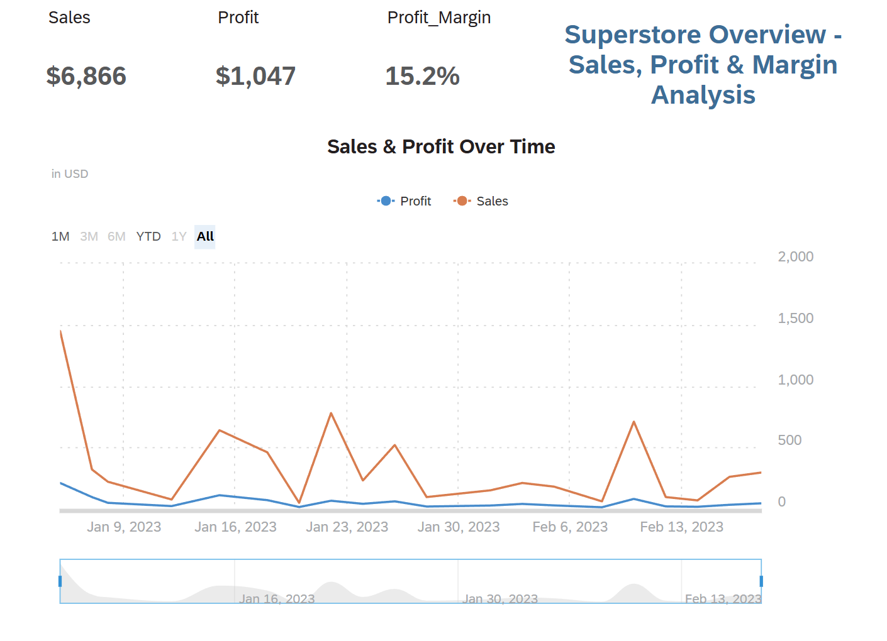
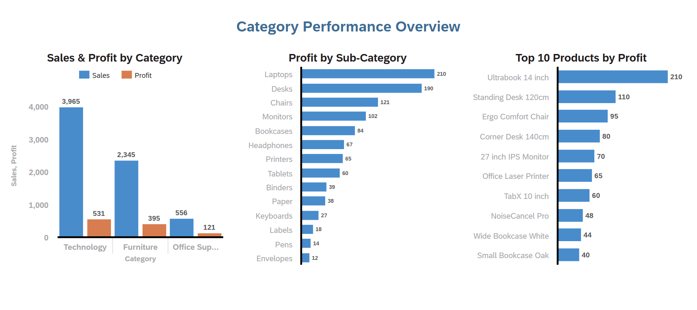
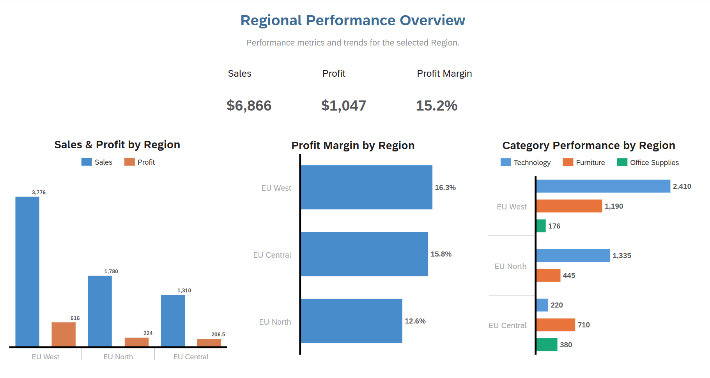
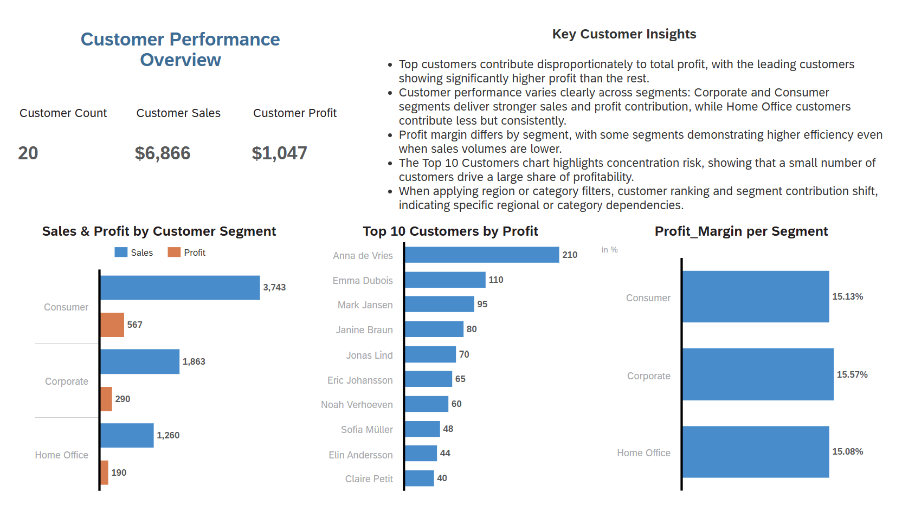

# SAP Analytics Cloud — Superstore Sales & Profit Analytics (Insights)
> Project 02 — Retail Profitability Analysis in SAP Analytics Cloud  
> Enterprise BI storytelling using SAP Analytics Cloud (SAC)

## Business Objective  
Analyze sales, profit, and margin performance across categories, regions, and customers using SAP Analytics Cloud, and demonstrate how the same business problem can be delivered using an enterprise SAP analytics platform.

This project mirrors a traditional profitability analysis use case, but focuses on SAC story design, interaction modeling, and executive-style narrative flow.

---

## Key Findings  

- Sales and profit performance vary significantly by region and category, indicating uneven margin contribution.
- Technology and Furniture categories contribute disproportionately higher profit compared to Office Supplies.
- Certain regions show strong sales volume but weaker margins, highlighting pricing or cost challenges.
- A small subset of customers drives a large share of total profit, reinforcing the importance of customer-level analysis.
- Profit margin differences across segments suggest opportunities for targeted pricing and portfolio optimization.

---

## Analytical Narrative (SAC Story Flow)

The SAC story is structured as a guided 4-step business narrative:

1. Executive Overview  
   - High-level KPIs for Sales, Profit, and Profit Margin  
   - Regional filtering for management-level performance review  
   - Time-based trend view to establish context

2. Category Performance  
   - Category → Sub-category drill-down  
   - Identification of high- and low-margin product areas  
   - Product-level profitability ranking

3. Regional Performance  
   - Comparative analysis of regions  
   - Profit margin differences across geographies  
   - Category performance within each region

4. Customer Performance  
   - Customer count, sales, and profit KPIs  
   - Top 10 customers by profit contribution  
   - Segment-wise customer profitability insights

This structure aligns with how SAC stories are used in enterprise reporting and management reviews.

---

## Dataset  
- Source: Superstore dataset  
- Type: Retail sales and profit data  
- Scope: Orders, customers, products, regions  
- Note: Focus is on SAC modeling and storytelling, not data engineering

---

## Skills Demonstrated  

- SAP Analytics Cloud (SAC) Story Design  
- KPI modeling and formatting  
- Interactive filtering and linked analysis  
- Profit margin calculation inside SAC  
- Executive-style dashboard storytelling  
- Enterprise BI design principles (IBPS-aligned)

---

## Dashboard Screenshots  

### Executive Overview  

### Category Performance  

### Regional Performance  

### Customer Performance  

---

## Files in This Project  

- SAC_Superstore_Sales_and_Profit_Analytics_Dashboard.pdf — full exported SAC story  
- PNG screenshots — page-level previews  
- All calculations created directly inside SAP Analytics Cloud

---

## Business Value  

This dashboard enables stakeholders to:
- Quickly assess overall sales and profit health  
- Identify priority regions, categories, and customers  
- Understand margin variation drivers  
- Navigate a structured, executive-ready analytical narrative  

It demonstrates the ability to deliver business-focused analytics using SAP’s enterprise BI platform.
