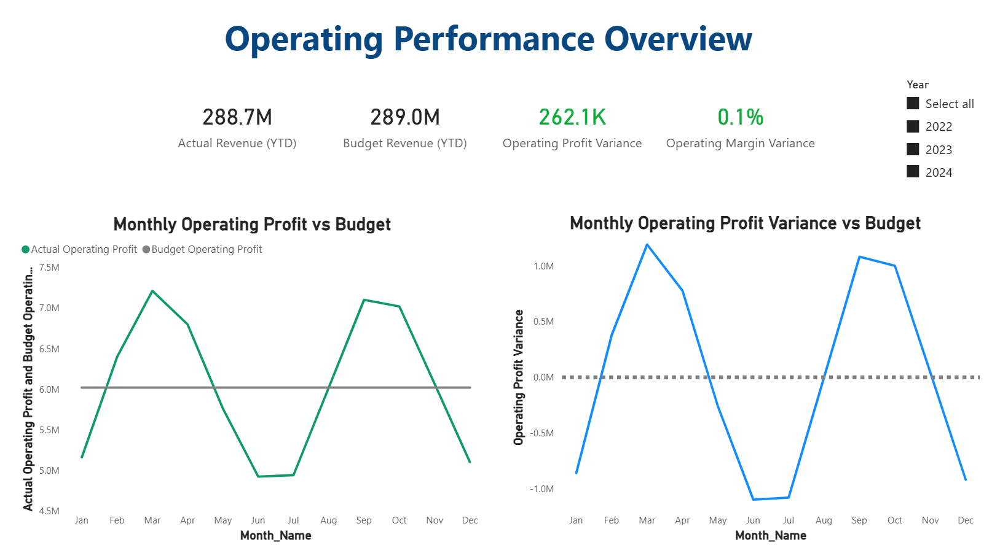
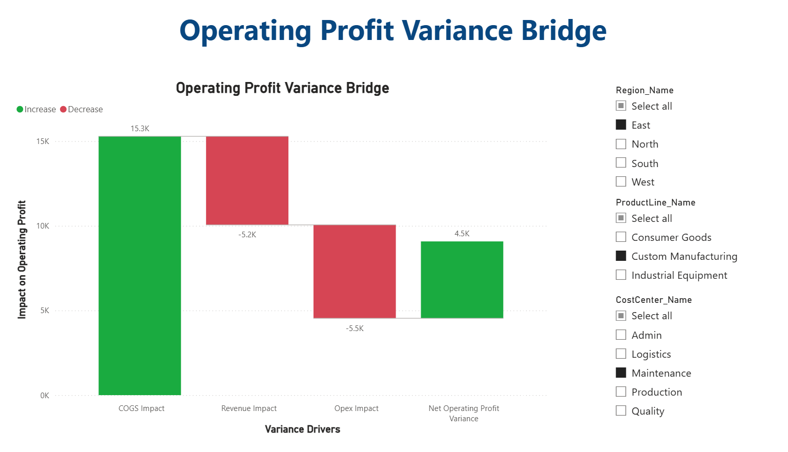

# Manufacturing FP&A Performance Analysis — Insights
> Project 03 — Manufacturing FP&A Performance  
> Financial performance analysis using Power BI (Actual vs Budget)

## Business Objective  
Evaluate manufacturing financial performance by comparing **Actual vs Budget results**, identify **operating profit variance drivers**, and present insights in an **FP&A-style executive dashboard**.

The objective is not visualization alone, but to demonstrate **financial reasoning, variance analysis, and management reporting structure** used in real FP&A teams.

---

## Key Findings  

- Actual Revenue is broadly in line with Budget at a high level, but **Operating Profit variance indicates margin pressure**.
- Monthly analysis shows **volatility in operating profit**, suggesting cost and revenue timing mismatches.
- Variance is not evenly distributed across the year — certain months drive the majority of deviation.
- A high-level bridge clearly explains how **Revenue, COGS, and Opex** collectively impact Operating Profit variance.
- Executive KPIs (YTD) provide a quick performance snapshot without overwhelming detail.

---

## Variance Explanation (FP&A View)

Operating Profit variance is explained using a **bridge approach**:

- Revenue impact captures topline deviations from plan.
- COGS impact reflects cost efficiency (or inefficiency).
- Opex impact highlights overhead control effectiveness.

This mirrors how FP&A teams explain results in monthly business reviews.

---

## Report Structure  

### Page 1 — Operating Performance Overview
- YTD KPIs: Actual Revenue, Budget Revenue, Operating Profit Variance, Margin Variance
- Monthly Operating Profit vs Budget trend
- Monthly Operating Profit Variance trend
- Interactive slicers and tooltips for period-level context

### Page 2 — Operating Profit Variance Bridge
- Waterfall bridge explaining variance drivers:
  - Revenue impact
  - COGS impact
  - Opex impact
- Designed for management-level variance storytelling

*(Tooltip pages are used for interaction support and are not standalone analysis pages.)*

---

## Dataset  
- **Type:** Synthetic manufacturing FP&A dataset  
- **Scope:** Monthly Actuals and Budget  
- **Grain:** Month-level financials  
- **Note:** Data is synthetic; focus is on **correct FP&A logic and reporting patterns**

---

## Skills Demonstrated  

- Power BI: multi-page executive dashboards, tooltips, interaction control  
- DAX: measure-driven profitability calculations (Operating Profit, Variance, Margin %)  
- FP&A concepts: Actual vs Budget analysis, variance bridges, management KPIs  
- Data modeling: star schema with clear Actual and Budget separation  
- Business storytelling: translating numbers into management-ready insights  

---

## Dashboard Screenshots  

### Operating Performance Overview

### Operating Profit Variance Bridge

---

## Files in This Project  

- Power BI dashboard screenshots (PNG)  
- Optional PDF export (if added)  
- Power BI `.pbix` source file — available on request  

---

## Business Value  

This analysis enables leadership to:
- Quickly assess whether the business is meeting plan
- Understand *why* operating profit deviates from budget
- Focus discussions on controllable drivers (cost, margin, timing)
- Conduct structured monthly performance reviews using FP&A best practices
